# RescueMatch

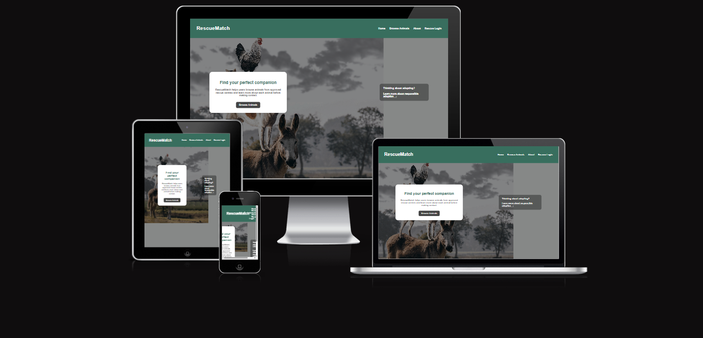

## Project Overview

RescueMatch is a pet rehoming website designed to help connect rescue centres with people looking to adopt animals.

Users can browse available animals, view information about each pet and match with animals they are interested in. Once a match has been made, the rescue centre contact details are revealed so the adoption process can begin.

The project was built using Python, Django, HTML and CSS. It includes front-end CRUD (Create, Read, Update and Delete) functionality that allows rescue centres to manage animal listings.

---

## Live Site

https://rescuematch.onrender.com

---

## Repository

https://github.com/Luke-Smith92/RescueMatch

---

## User Experience (UX)

The aim of RescueMatch is to provide a simple and user-friendly platform where people can browse animals available for adoption and connect with rescue centres.

The website was designed with simplicity in mind to ensure users can easily navigate between pages and access information about animals available for adoption.

The project also provides rescue centres with the ability to manage animal listings through front-end CRUD functionality.

---

## User Stories

### First Time Visitor

- I want to understand what RescueMatch does.
- I want to browse available animals.
- I want to view animal information before making a decision.
- I want an easy-to-use website.

### Returning Visitor

- I want to check for new animals.
- I want to continue browsing animals.
- I want to match with animals I am interested in.

### Rescue Centre User

- I want to add new animal listings.
- I want to edit existing listings.
- I want to remove animals that have been adopted.
- I want to manage all available animals in one place.

---

## Wireframes

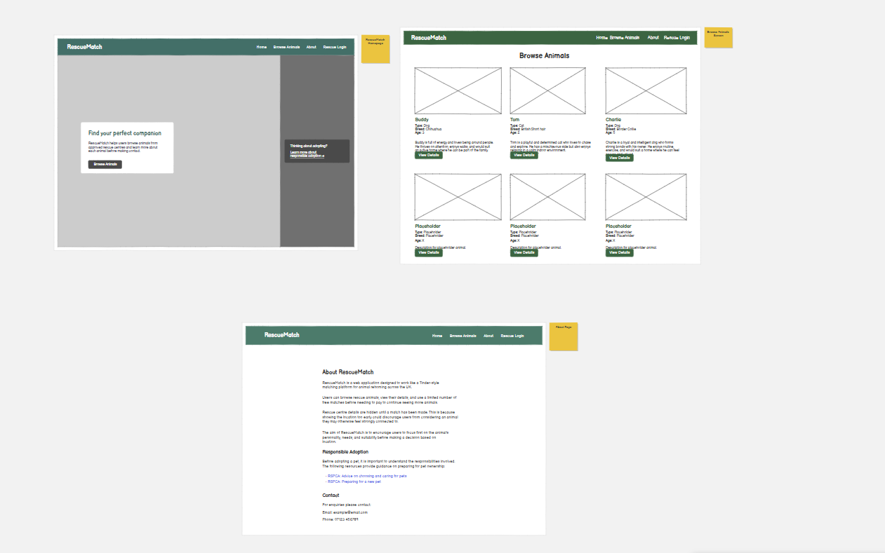

A wireframe was created during the planning stage of the project to help visualise the structure and layout of the website before development began.

The wireframe focused on:

- Home Page
- Browse Animals Page
- About Page
- Rescue Login
- Navigation structure
- User journey

The final website closely follows the original wireframe while adding additional functionality such as CRUD operations, animal detail pages and the match system.

---

## Features

### Current Features

- Home page with project introduction
- Browse animals page
- Animal detail pages
- Match system
- Rescue centre contact reveal
- Rescue login page
- Animal management portal
- Add animal functionality
- Edit animal functionality
- Delete animal functionality
- Responsive navigation
- Responsive design
- Database-backed animal listings
- One-to-many database relationship between RescueCentre and Animal

---

## Home Page

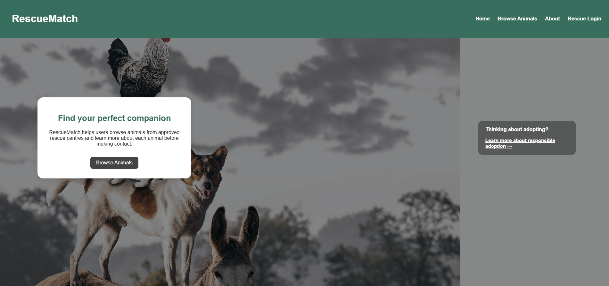

The Home Page introduces the RescueMatch platform and explains the purpose of the website. Users can quickly navigate to browse available animals, learn more about the adoption process and access the Rescue Centre Portal.

The page was designed to provide a clear introduction to the website while keeping navigation simple and accessible.

---

## Browse Animals

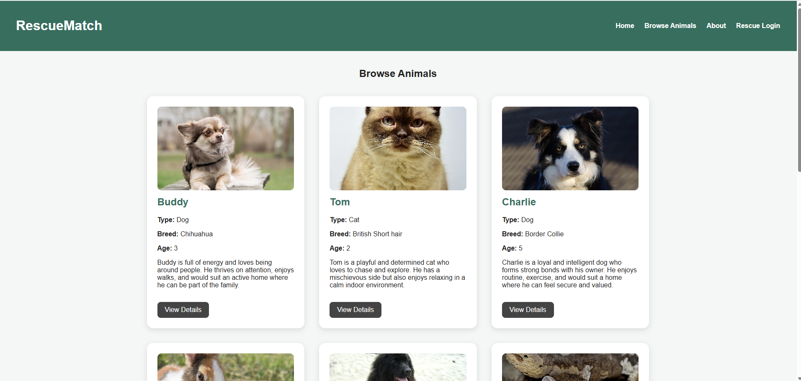

The Browse Animals page displays all available animals currently listed for adoption.

Each animal is displayed within a card layout containing:

- Animal image
- Name
- Animal type
- Breed
- Age
- View Details button

This allows users to quickly browse multiple animals before choosing which profile they would like to view.

---

## Animal Detail Page

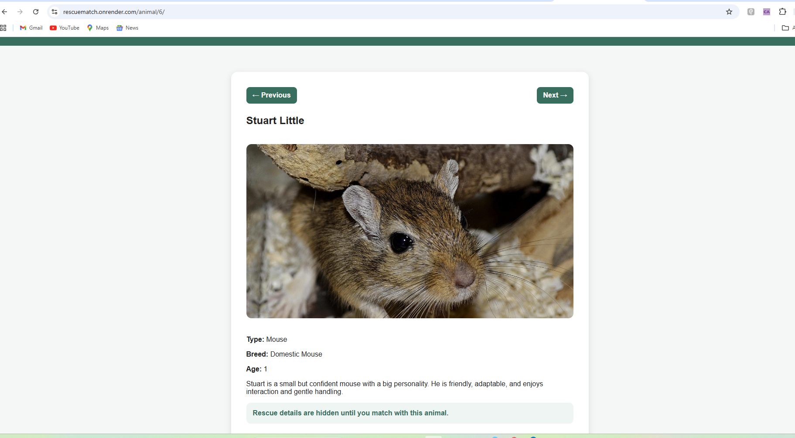

Each animal has its own dedicated profile page containing detailed information about the animal.

Information displayed includes:

- Name
- Animal type
- Breed
- Age
- Description
- Animal image

Users can then choose to match with the animal.

---

## View Animal

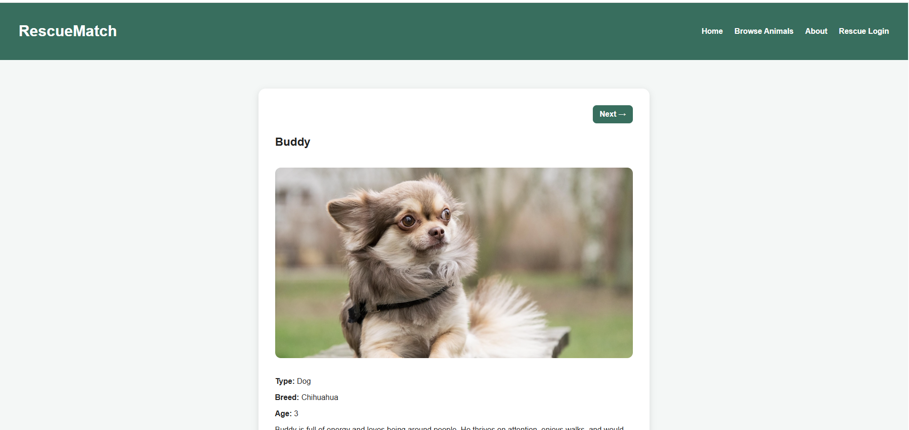

The View Animal page allows users to read detailed information about an animal before deciding whether they would like to adopt.

Previous and Next navigation buttons were added to improve usability and allow users to browse through animal profiles more easily.

---

## Match System


A key feature of RescueMatch is the Match System.

Before a match is made, rescue centre details remain hidden from the user.

When the user selects the Match button, the rescue centre details become visible including:

- Rescue Centre Name
- Location
- Email Address
- Telephone Number

This encourages users to focus on the animal rather than location before expressing interest.

---

## About Page

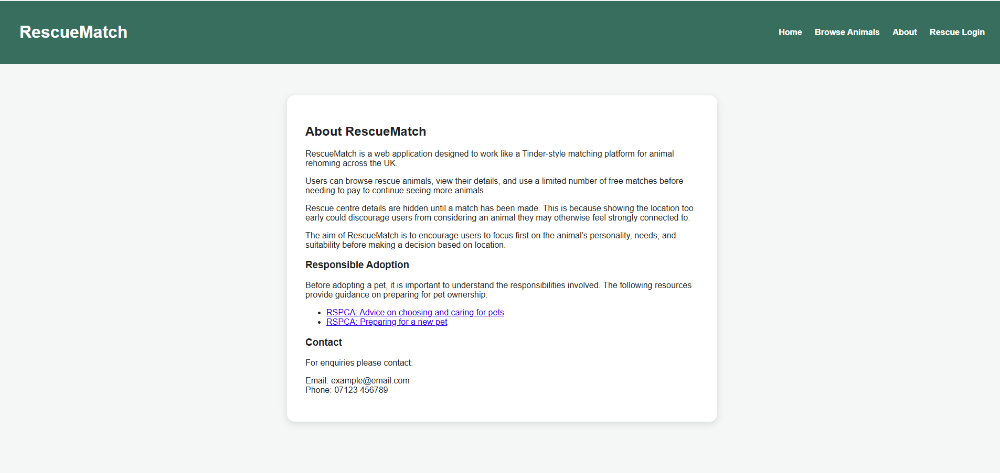

The About Page explains the purpose of RescueMatch and provides information about responsible pet ownership.

The page also includes useful external links and guidance for potential adopters before committing to animal ownership.

---

## Rescue Login

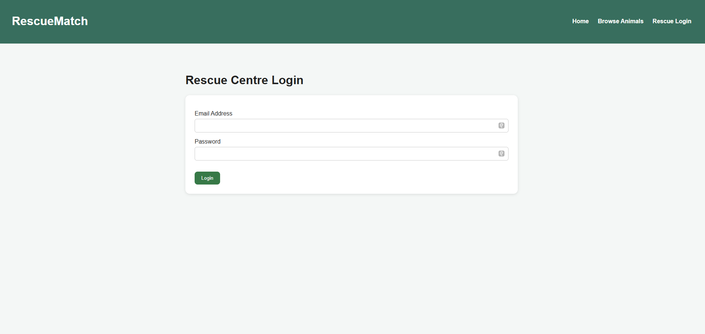

The Rescue Login page provides access to the Rescue Centre Portal.

For the current version of the project this page demonstrates the intended user journey and portal access.

A secure authentication system has not yet been implemented and would be added in a future version of the project.

---

## Manage Animals

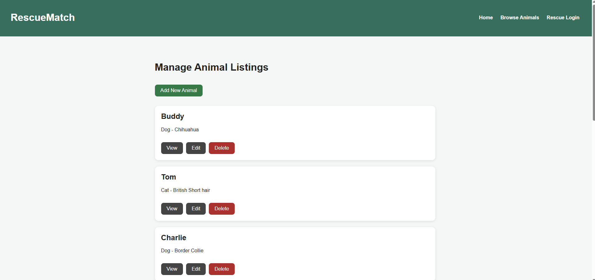

The Manage Animals page allows rescue centres to view and manage current animal listings.

From this page rescue centres can:

- View current animals
- Add animals
- Edit animals
- Delete animals

This page acts as the main management area for rescue centre users.

---

## Edit Animal

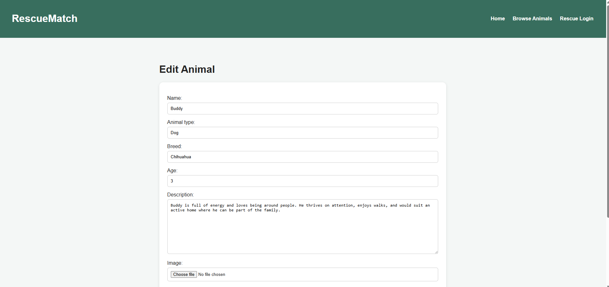

The Edit Animal page allows rescue centres to update information about an animal already stored within the database.

This functionality forms part of the CRUD requirements of the project.

---

## Delete Animal

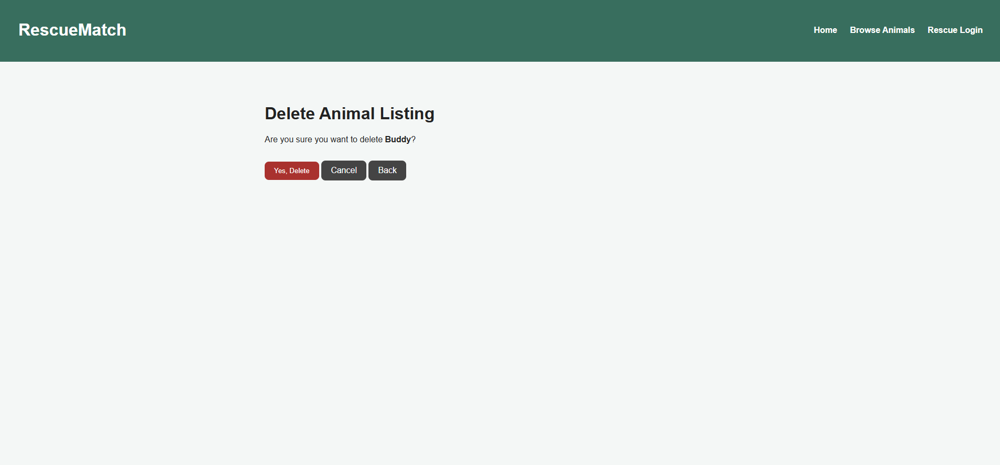

The Delete Animal page allows rescue centres to remove animal listings from the website.

This functionality forms part of the CRUD requirements and allows records to be removed when animals are adopted or no longer available.

---

## Database Structure

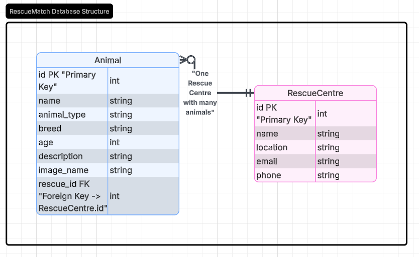

The project uses two main database models:

### RescueCentre

The RescueCentre model stores information about rescue centres including:

- Name
- Location
- Email
- Phone Number

### Animal

The Animal model stores information about animals including:

- Name
- Animal Type
- Breed
- Age
- Description
- Image Name

A one-to-many relationship exists between the models.

One rescue centre can manage multiple animals while each animal belongs to a single rescue centre.

This relationship is achieved using a Foreign Key within the Animal model which links each animal to a RescueCentre record.

---

## Responsive Design


The website was designed using responsive design principles to ensure usability across desktop, tablet and mobile devices.

Testing was carried out using the Am I Responsive tool which confirmed that the website adapts correctly across multiple screen sizes.

The layout adjusts automatically depending on screen size to maintain usability and readability.

---

## Technologies Used

### Languages

- HTML
- CSS
- Python

### Frameworks

- Django

### Database

- SQLite

### Tools

- Git
- GitHub
- VS Code
- Render
- Lucidchart

---

---

## Testing

Testing was carried out throughout the project to check that the website worked as expected.

Testing included:

- Manual testing
- HTML validation
- CSS validation
- Lighthouse testing
- Responsive testing
- Live site testing on Render

---

## Manual Testing

| Feature | Expected Result | Actual Result | Pass/Fail |
|---|---|---|---|
| Home Page | Page loads correctly | Home page loaded correctly | Pass |
| Browse Animals | Animals display in a grid | Animals displayed correctly | Pass |
| Animal Detail Page | Animal information displays | Animal details displayed correctly | Pass |
| Match Button | Rescue details are revealed | Rescue details appeared after matching | Pass |
| Previous Animal Button | User moves to previous animal | Previous animal loaded correctly | Pass |
| Next Animal Button | User moves to next animal | Next animal loaded correctly | Pass |
| Rescue Login | User can access portal route | Login page allowed access to portal | Pass |
| Manage Animals | Animal listings display | Listings displayed correctly | Pass |
| Edit Animal | Animal details can be updated | Animal record updated correctly | Pass |
| Delete Animal | Animal can be removed | Animal was removed from the page | Pass |
| Navigation | Links move to correct pages | Navigation worked correctly | Pass |
| Responsive Layout | Site adjusts on smaller screens | Site displayed correctly on mobile/tablet | Pass |

---

## HTML Validation

### Home Page

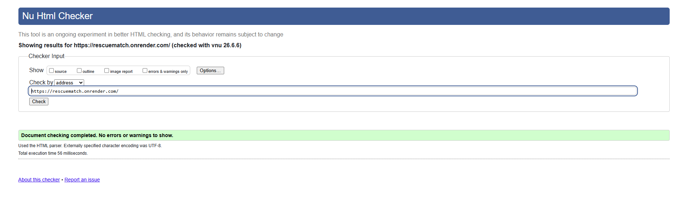

The Home Page was tested using the W3C HTML Validator. Any issues found during testing were corrected.

---

### Browse Animals Page

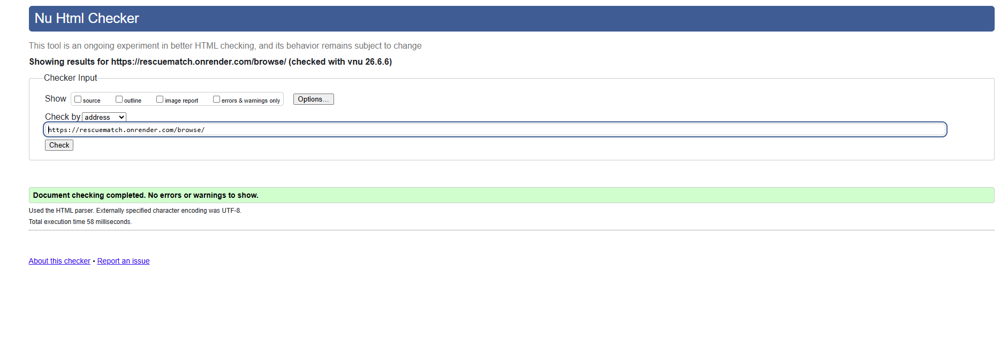

The Browse Animals page was tested using the W3C HTML Validator and checked for HTML structure issues.

---

### Animal Page

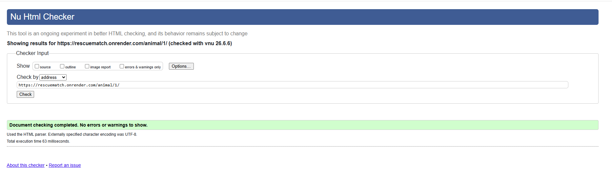

The Animal Detail page was tested using the W3C HTML Validator. An unclosed section tag was found during testing and fixed.

---

### About Page

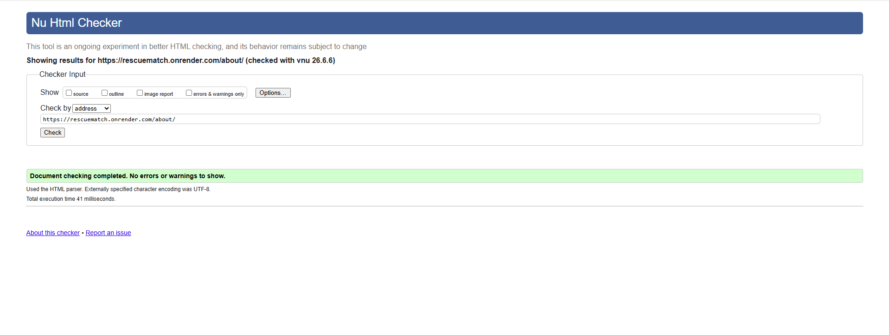

The About Page was tested using the W3C HTML Validator.

---

### Login Page

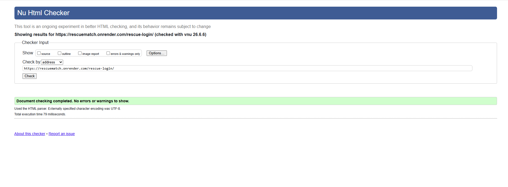

The Rescue Login page was tested using the W3C HTML Validator.

---

### Manage Animals Page

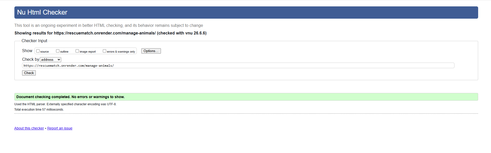

The Manage Animals page was tested using the W3C HTML Validator.

---

### Delete Page

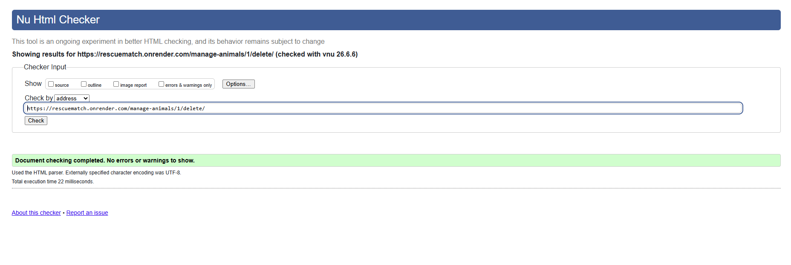

The Delete Animal page was tested using the W3C HTML Validator.

---

## CSS Validation

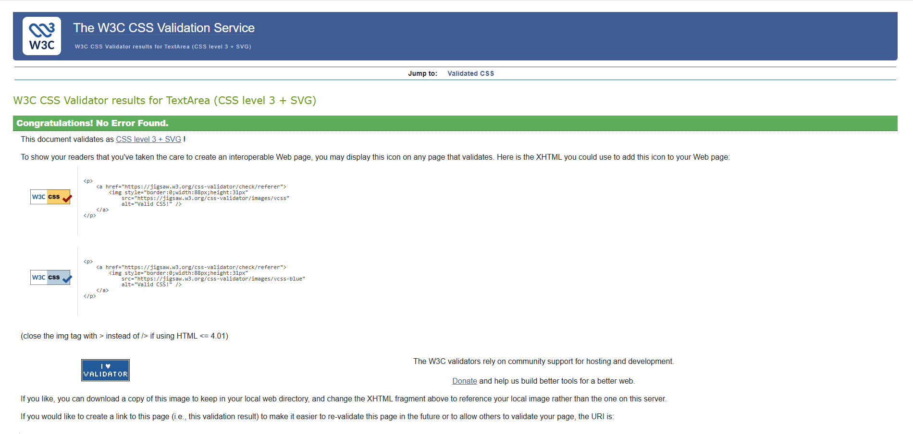

The CSS was tested using the W3C CSS Validator.

The stylesheet was checked to make sure there were no major CSS issues affecting the website layout or styling.

---

## Lighthouse Testing

Lighthouse testing was carried out using Google PageSpeed Insights.

Lighthouse checks:

- Performance
- Accessibility
- Best Practices
- SEO (Search Engine Optimisation)

Search Engine Optimisation (SEO) measures how easily search engines can understand and index a website.

---

### Mobile Lighthouse - Home Page

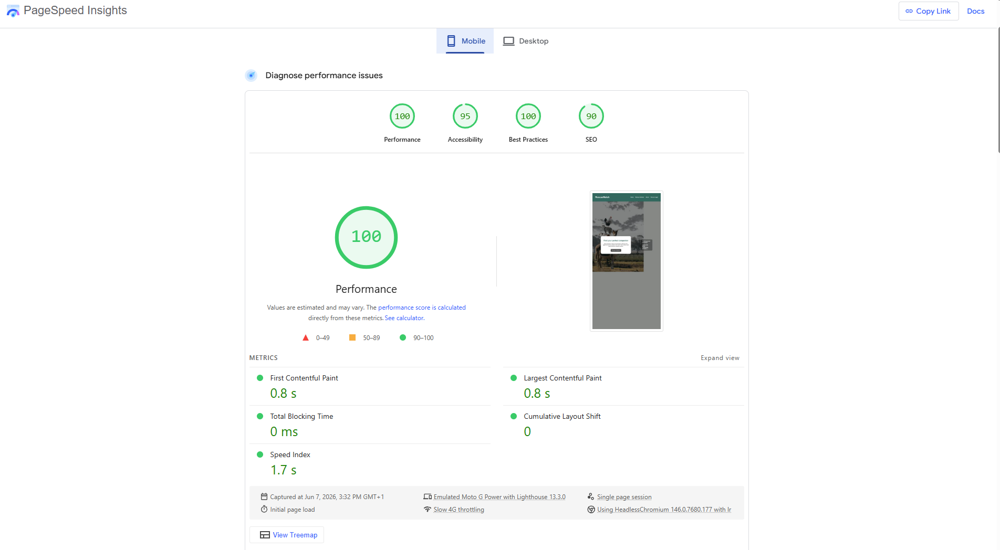

The Home Page was tested on mobile using Lighthouse.

---

### Desktop Lighthouse - Home Page

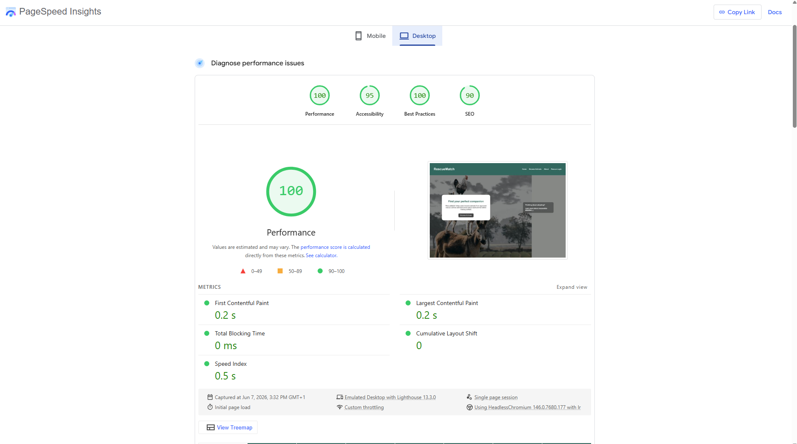

The Home Page was tested on desktop using Lighthouse.

---

### Mobile Lighthouse - Browse Animals

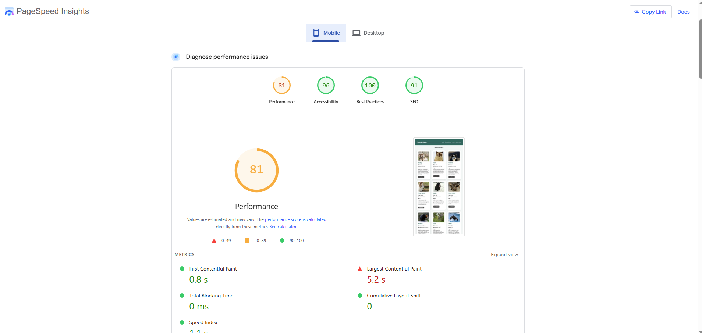

The Browse Animals page was tested on mobile using Lighthouse.

---

### Desktop Lighthouse - Browse Animals

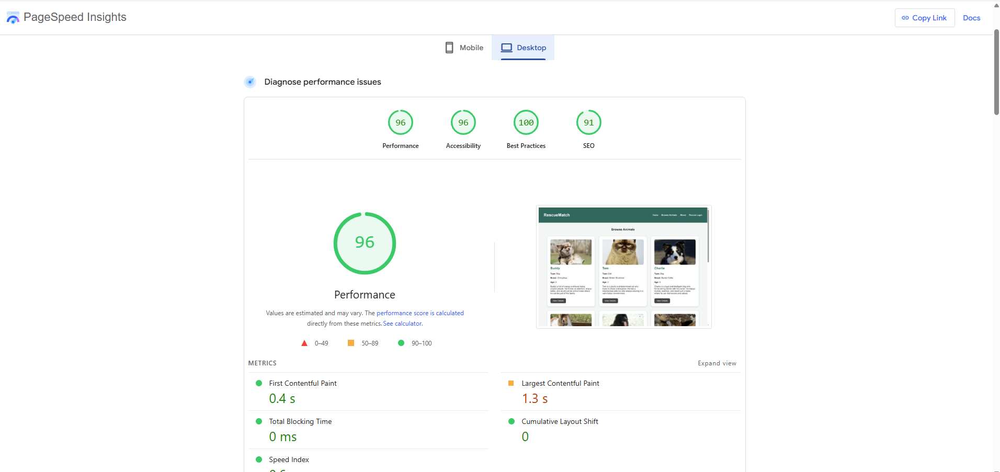

The Browse Animals page was tested on desktop using Lighthouse.

---

## Python Validation

The project's Python files were validated using the Code Institute Python Linter to ensure they follow the PEP8 style guide. Any warnings identified were reviewed and resolved where appropriate before deployment.

### manage.py

The `manage.py` file was validated using the Code Institute Python Linter.


### settings.py

The `settings.py` file was validated using the Code Institute Python Linter.


### views.py

The `views.py` file was validated using the Code Institute Python Linter.


### models.py

The `models.py` file was validated using the Code Institute Python Linter.


### forms.py

The `forms.py` file was validated using the Code Institute Python Linter.


---

## Bugs and Fixes

### Flask to Django Change

The project was originally started using Flask before changing to Django.

This was changed because Django was better suited for this project as it allowed proper database models, relationships and CRUD functionality.

---

### Template Does Not Exist Error

During development, the Manage Animals page produced a `TemplateDoesNotExist` error.

This happened because Django was looking for `manage_animals.html`, but the template file had been named incorrectly.

The issue was fixed by renaming the template file correctly and making sure the view pointed to the correct template.

---

### HTML Validation Error

During HTML validation, the W3C Validator reported an error on the Animal Detail page caused by an unclosed `<section>` element.

The issue was fixed by adding the missing closing `</section>` tag.

After this was fixed, the page validated correctly.

---

### Render Deployment Issues

There were several issues while deploying the project to Render.

The first issue was that Render could not find the `requirements.txt` file.

This was fixed by creating the requirements file and moving it into the correct Django project folder.

Another issue was caused by `gunicorn` not being installed. This was fixed by installing `gunicorn` and updating the requirements file.

There was also an issue with Render not finding the Django project module. This was fixed by setting the correct root directory in Render.

---

### Static File Problems on Render

After the website deployed, the CSS and images did not load correctly on the live site.

This made the website appear unstyled even though the Django application itself was running.

The issue was fixed by:

- Installing WhiteNoise
- Adding WhiteNoise to the middleware
- Setting `STATIC_ROOT`
- Running `collectstatic`
- Updating the Render build command

Online documentation, Google and some AI assistance were used to help troubleshoot these deployment issues.

---

### Rescue Centre Data

Originally, animals could be linked to different rescue centres.

For the current version of the project, all animals were updated to use the same rescue centre record. This made the project clearer for demonstration while still keeping the database structure ready for more rescue centres in future versions.

---

### Delete Data Persistence Issue

During testing, the delete function removed an animal from the page, but the animal returned after the live site was reloaded.

This appears to be caused by the deployed database or sample data resetting on Render.

The delete functionality works during the session, but persistent database storage would need to be improved in a future version.

A future improvement would be to connect the project to a persistent production database such as PostgreSQL so deleted records remain deleted after reloads or redeployments.

---

## Deployment

The project was deployed using Render.

## Live Site

https://rescuematch.onrender.com

## Repository

https://github.com/Luke-Smith92/RescueMatch

---

## Local Deployment

To run this project locally:

1. Clone the repository:

```bash
git clone https://github.com/Luke-Smith92/RescueMatch.git
```

2. Move into the project folder:

```bash
cd RescueMatch/rescuematch
```

3. Install the requirements:

```bash
pip install -r requirements.txt
```

4. Run migrations:

```bash
python manage.py migrate
```

5. Start the development server:

```bash
python manage.py runserver
```

6. Open the project in the browser:

```text
http://127.0.0.1:8000/
```

---

## Render Deployment Steps

The deployed version was set up on Render using the following steps:

1. Create a new Web Service on Render
2. Connect the GitHub repository
3. Set the root directory to the Django project folder
4. Set the build command:

```bash
pip install -r requirements.txt && python manage.py collectstatic --noinput
```

5. Set the start command:

```bash
gunicorn rescuematch_project.wsgi
```

6. Add the Render URL to `ALLOWED_HOSTS`
7. Configure WhiteNoise for static files
8. Deploy the latest GitHub commit

---

## Version Control

Git and GitHub were used throughout the project.

Commits were made during development to track:

- Project setup
- Django changes
- CRUD functionality
- Template fixes
- Deployment fixes
- README updates
- Screenshot and testing evidence

---

## Future Improvements

Future improvements for RescueMatch could include:

- Secure login system for rescue centres
- Individual rescue centre accounts
- Rescue centres managing only their own animal listings
- Password protected Rescue Centre Portal
- User accounts for adopters
- Saved matches
- Messaging system between adopters and rescue centres
- Advanced search and filtering
- Mobile hamburger navigation menu
- More detailed animal profiles
- Persistent PostgreSQL database for the deployed version
- Multiple rescue centres being able to log in and manage their own animals

---

## Credits

### Code

The project was built by Luke Smith using Django, HTML and CSS.

Django documentation, Render documentation, Google searches and AI assistance were used during development to help with debugging, deployment issues and code understanding.

---

### Images Used

All animal images used in this project were sourced from Pixabay and are free to use under the Pixabay Content License.

| Animal | Credit |
|---|---|
| Buddy (Chihuahua) | Photo by RebeccasPictures |
| Charlie (Border Collie) | Photo by Alexas_Fotos |
| Peter Rabbit (Rabbit) | Photo by Jackielou DL (JACLOU-DL) |
| Spike (Newfoundland) | Photo by Roksana Helscher (Roksana96) |
| Rodney (Guinea Pig) | Photo by Yvinne |
| Zara (Zebra) | Photo by Pete Ball (peterjohnball0) |
| Willie (Orca) | Photo by James Hills |

---

## Author

Created by Luke Smith